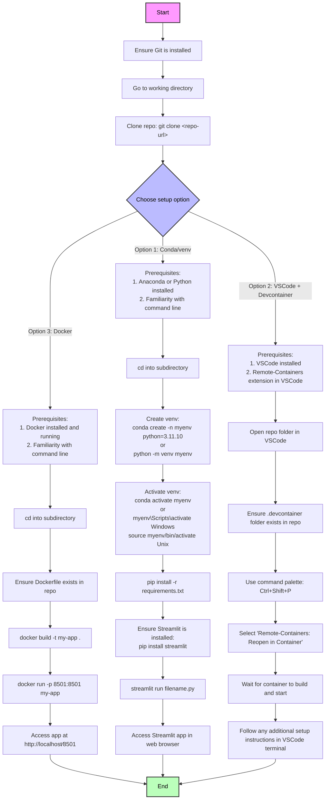

## This README is based on Mindrocket's "Clueless Coder" standard

### Reasons for Fork
- dependencies in requirements.txt 'frozen' to allow repo to age gracefully
- improved README

### PREREQUISITES

##### - Python 3.11.10

##### - OpenRouter Account

##### - VSCode & Dev Containers are optional and only of value if you want to tinker with code

### If you aren't up and running in 15 minutes, WALK AWAY. OpenRouter Playground is a lot less painful

- If you are comfortable working with venv's, use Option 1
- If you don't see the point of venv's, use Option 2
- Option 3 and Docker. If you know, you know. If you don't know, AVOID

### Important Notices

#### Devcontainer
/.devcontainer/devcontainer.json has deliberately been misnamed ".devcontainer.json". This is to avoid VSCode or Docker launching Devcontainer for a user unfamiliar with the purpose and functionality of Devcontainers.
To use, rename the filename to "devcontainer.json"

#### Defaults
/shared/constants.py contains default OpenRouter settings including default LLMs.





## 🔀 OpenRouter + Streamlit Example App

[](https://codespaces.new/mindrocket42/openrouter-streamlit?quickstart=1)

Starter examples for building LLM apps with Streamlit and [OpenRouter](https://openrouter.ai), using [OpenRouter OAuth PCKE](https://openrouter.ai/docs#oauth).


### Reasons for Fork
- requirements.txt is frozen to allow repo to age gracefully
- improved README

## Overview of the App

OpenRouter is a single access point, cost centre and API standard in a landscape of a growing number of LLMs. This repo is a minimum working example of using a single API to access multiple language models, including [OpenAI's o1-mini and o1-preview, Anthropic's Claude, Google's Gemini and many more](https://openrouter.ai/docs#models).

Current examples include:

- Chatbot
- File Q&A
- Langchain Quickstart
- Langchain PromptTemplate
- LangChain Search (requires a Serper.dev API key)

## Demo App

[](https://openrouter-42.streamlit.app/)

## Running the code

```bash
python -m venv .venv
source .venv/bin/activate
pip install -r requirements.txt
streamlit run Chatbot.py
```

## Setting API keys

Not needed! 
- Click the **Connect OpenRouter** button on the sidebar on the left and your API key will be auto-applied using an [OAuth PKCE flow](https://openrouter.ai/docs#oauth).
- If using LangChain search, enter your Serper API key in the field provided (also on the sidebar on the left of the screen